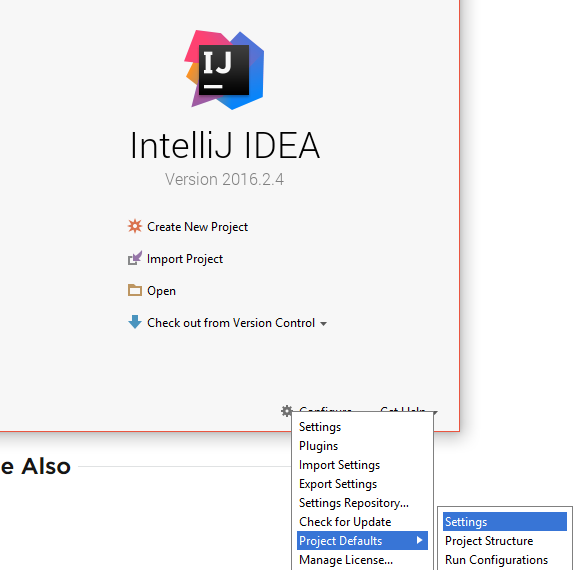
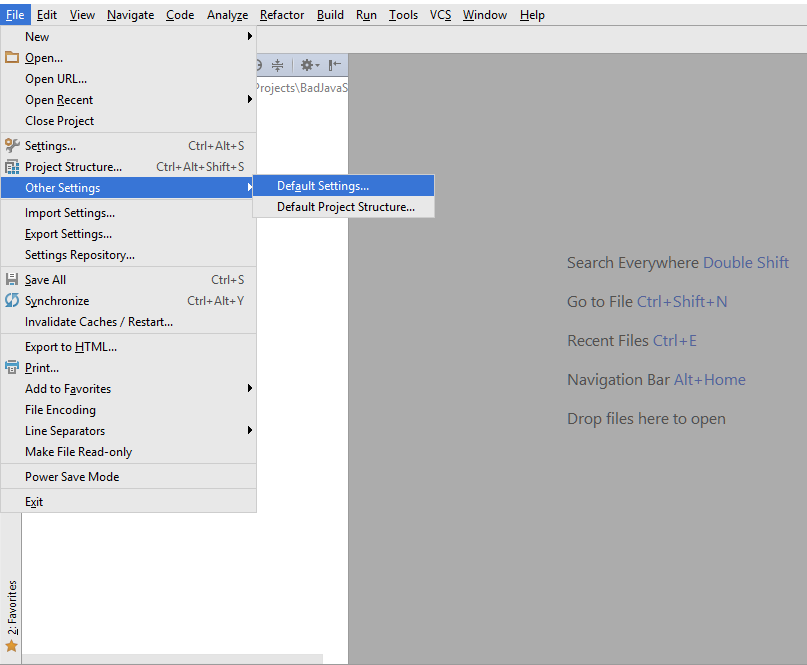

So what’s the deal with coding standards? What are they for? Are they a boon to the software development process, or are they just one more detail to get bogged down in? You might get different answers to these questions depending on who you ask, but if you asked me I would tell you that coding standards are the friend of anyone who reads or writes code.

## Define Coding Standard

But before we get too far, let’s talk about what coding standards encompass. A coding standard defines many aspects of how a programmer writes their code. Everything from whether or not you should have spaces after opening parentheses to the preferred method of variable iteration (e.g. i += 1 vs. i++) can be covered in a coding standard. Each one is a little different. In the end, it doesn’t matter so much what rules are included; it’s the consistent use of the standard for all of the code in a project that is valuable.

## Friend?

Any developer would agree: dissecting a complex software system takes some work. It’s difficult enough without having to decipher non-standard syntax and inconsistent indentation patterns. That’s why people who are in the coding business use coding standards. They’re useful for any project really, from small, personal programs to large-scale industrial systems. This is because consistent patterns in the structure of the code help anyone, including the person who wrote it, to read and understand it more easily.

## Or Foe?

Not everyone will be convinced at this point. I can hear them saying, “But it’s tedious to make your code adhere to coding standards.” Yes, it absolutely is! That’s why we use tools to automatically enforce them. The combination of your favorite IDE with plugins such as Checkstyle, ESLint, and others makes sticking to coding standards in your chosen language much easier, because any code that deviates from the standard is flagged within the editor. Now, rather than having to go through all the rules one by one to ensure that your code completely conforms, you can simply make the fixes that you need to and continue on your merry way. 

## But It’s Never That Simple

Of course, as programmers, we are always presented with new opportunities for frustrations to arise. Recently, I began using ESLint as my coding-standard-enforcing development tool for projects in IntelliJ IDEA. To my dismay, after dialing in all my settings, I discovered that they only applied to a single project.

Having the ability to define a coding standard for each individual project is nice in that it allows flexibility. However, if you want code across all of your projects to conform to a single standard it could become extremely tedious to do over and over again. And tedious is exactly what we want to avoid. 

Fortunately, IntelliJ allows us to define default project settings, which can include a default coding standard. This means that, after setting these rules, all new projects we create will automatically have everything configured and ready to go. 

From the IntelliJ startup menu, you can find the default project settings under Configure -> Project Defaults -> Settings.

If you already have an IntelliJ project open, you can find these settings under File -> Other Settings -> Default Settings.

#### Note: I am running IntelliJ on a PC with Windows. I am not sure if the steps are exactly the same on a Mac.

## Becoming Friends with your Coding Standard

Now that you’ve set everything up for ease of use, it will be much easier to stick to a coding standard. Having the right tools makes maintaining the standard painless, and allows you to appreciate the beauty that a consistent style brings to your code. I hope that these guidelines lead you to a happier and healthier relationship with your coding standards and a fuller appreciation of well written code!

 
