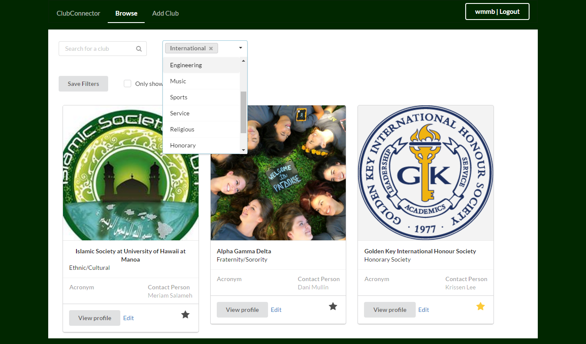

 

---

 

## Overview

 During the fall of 2016, I and a team of fellow UH Manoa software engineering students built a modern web app using the Meteor framework. We called it Club Connector, because its purpose was to help UH Manoa students easily sift through UH's 200+ clubs to find the ones that fit them best.

  

  

The core features of the app reside in the Browse page, where students can view an array of club results in response to a query by keyword or by type of club. It also allows students to favorite clubs that they are interested in, so that they can remember them later on.

 

---

 

### Responsibilities

The design of the club profile page, which displays the detailed club description and contact information, was my responsibility. I was also responsible for implementing the back-end and front-end functionality of the forms which allow admins to add and edit club information.

 

  

 

---

 

### User Study

At the end of our fall 2016 semester, we hand-picked a small group of students to test our app and provide us with feedback for improvement. Based on the feedback we received we were able to immediately improve visual elements of our app. Our test users also requested new features that we had not previously recognized a need for. This initial review experience was validating and encouraging and will help to guide our development in the future.

 

---

 

### More Info

Want to learn more? Check out project homepage [here](https://clubconnector.github.io/).

