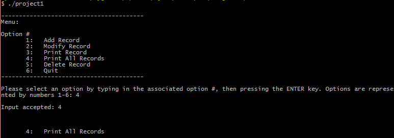

 

 

I created a mock customer database interface in the C programming language for ICS 212, Program Structure. The application has no GUI, but is designed to be used through the command-line interface (CLI). When the application is started a menu is displayed prompting the user to choose one of several options. Options include:

1. Add Record
2. Modify Record
3. Print Record
4. Print All Records
5. Delete Record
6. Quit

Implementation of the application took about a week. I was the sole author of this project, and it was written entirely in C. It was also the first program I have written that makes use of command-line arguments.

Programming this application gave me a deeper understanding of pointers, including pointers to pointers and why they can be useful. The experience also engrained in me the importance of testing/validating user input, and handling unexpected input in an appropriate manner. This project, and having Ravi Narayan as a teacher, made me love the C programming language.

 
 
Source: <a href="https://github.com/wyattbartlett/customer-database-interface-c"><i class="large github icon"></i>Check out my repo on GitHub.</a>

 
