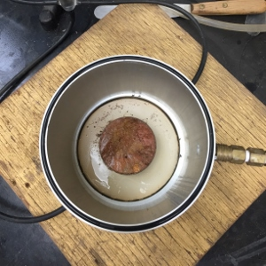
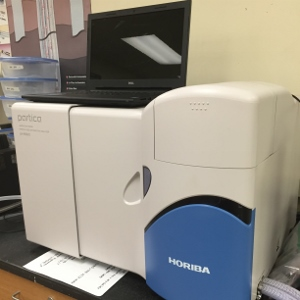
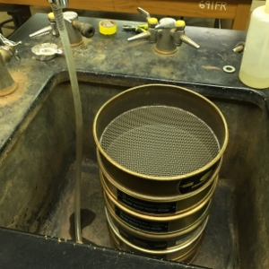

  
  
  
  

John Nihi and I conducted research on soil samples to predict how the stability of the slopes from which they were drawn would be affected by saturation during rainfall events. We won a first place prize at the [2015 Indigenous Knowledge in Engineering (IKE) Symposium](http://manoa.hawaii.edu/kaunana/student-engineers-participate-in-native-hawaiian-stem-symposium/).

You can view our presentation slides [on Slideshare](http://www.slideshare.net/wmmb/landslide-early-warning-system-john-nihi-wyatt-bartlett).

