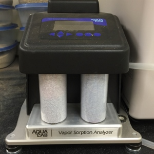

  
  
  
  

## Overview

During the summer of 2015, John Nihi and I conducted research on soil samples to predict how the stability of the slopes from which they were drawn would be affected by saturation during rainfall events. We won a first place prize at the [2015 Indigenous Knowledge in Engineering (IKE) Symposium](http://manoa.hawaii.edu/kaunana/student-engineers-participate-in-native-hawaiian-stem-symposium/).

The Landslide Early Warning System project was sponsored by the State of Hawaii Department of Transportation. The soil samples we analyzed came from areas where landslides might occur along the Pali and Likelike highways. The areas of interest were a natural cut slope and a manmade embankment, respectively.

## Goals

Our task was to construct experimental and theoretical grain size distribution (GSD) curves for our various soil samples, and to compare these with data collected from instruments at the field sites to determine the effect of soil saturation on slope stability.

### Soil-Water Characteristic Curve

The main goal of our work was to create a more accurate model for predicting slope failure. We did this by using the soil-water characteristic curve (SWCC), which compares soil saturation to soil suction (negative pressure between soil particles). Greater saturation of the soil leads to reduced suction. Less suction generally means less shear strength, implying that a slope is more likely to fail. On the other hand, less saturation generally implies greater shear strength, greater suction and a more stable slope. Local companies currently use traditional soil mechanics in their analyses, neglecting suction and assuming full soil saturation. According to their models, the slopes at the sites of interest should have already failed. We believed that we could provide evidence that considering suction might lead to a more realistic model.

To do this, we created both a theoretical and experimental SWCC. In order to create our theoretical curve, we first conducted gradation analysis on all of our soil samples to create grain-size distribution (GSD) curves. We were then able to transform the data into our theoretical SWCC using the Soil Vision software. For our experimental curve, we used Pressure Plate and Vapor Sorption Analyzer (VSA) tests. Finally, we combined the theoretical and experimental curves with water content data from the field. At the time that I left this project, the experimental curve was not yet complete, because it took a long time to run Pressure Plate experiments in the lab. However, the points of the experimental curve that we were able to plot fit the theoretical curve well. Our analysis showed that saturation, and the reduction in suction that accompanies it, had a measurable effect on soil stability in samples from the areas of interest.

### Sieve/Hydrometer vs. Laser Diffraction

Since we were already creating GSD curves for use in constructing our theoretical SWCC, we were also able to compare the classical (and standard) wet sieve/hydrometer method of soil gradation to the newer laser diffraction method. There are known advantages and disadvantages to each method. 

We compared the accuracy of each method in specific ranges. The hydrometer method tends to overestimate clay-sized particles, while the laser diffraction method tends to underestimate them. 

We also compared how long it took to perform our experiments with each method. It took us about 4-5 days to completely grade samples using the wet sieve/hydrometer method, and about 10-15 minutes to completely grade samples using the laser diffraction method. 

There are also differences between individual laser diffraction machines, but in our experiments we used only the Horiba LA-950V2.

Through our analysis, we concluded that use of the Horiba LA-950V2 approximates GSD with a degree of accuracy similar to traditional methods at a much lower time cost.

You can view our presentation slides [on Slideshare](http://www.slideshare.net/wmmb/landslide-early-warning-system-john-nihi-wyatt-bartlett).

